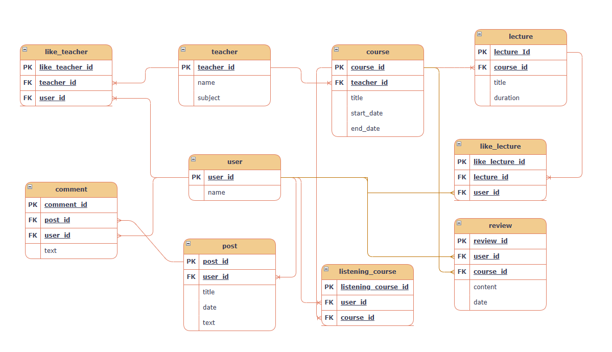

# 📚 Lecture-DB-Service
> **AI Agent 및 RAG 기술을 활용한 지능형 교육 플랫폼 데이터베이스 설계 프로젝트**

## 1. 프로젝트 개요
사용자가 강의를 탐색하고, 수강 신청하며, 강사와 소통하는 교육 서비스의 핵심 데이터 구조를 설계했습니다. 특히 **실시간 강좌 상태 조회**와 **복합 데이터 추출(JOIN) 로직 최적화**에 집중하여 실무적인 역량을 키우는 데 목적을 두었습니다.

## 2. 폴더 구조 (Project Structure)
프로젝트 리소스를 체계적으로 관리하기 위해 다음과 같은 구조로 설계되었습니다.

```text
lecture-db-design/
├── design/                 # 시각적 설계 자산
│   ├── erd_v1.drawio       # ERD 원본 파일
│   ├── erd_v1.png          # ERD 이미지 파일
│   └── wireframes/         # 서비스 화면 설계 (Wireframes)
│       ├── wireframes_01.png
│       └── wireframes_02.png
├── docs/                   # 설계 상세 문서
│   ├── api_spec.md         # API 명세 및 SQL 쿼리 정의
│   ├── data_dictionary.md  # 데이터베이스 컬럼 상세 설명
│   ├── requirements.md     # RAG 기반 설계 목적 및 요구사항
│   └── user_scenario.md    # 사용자 서비스 이용 시나리오
└── README.md               # 프로젝트 가이드 및 요약본
```

## 3. 데이터베이스 설계 (ERD)
프로젝트의 확장성을 고려하여 **10개의 핵심 테이블**로 구성했습니다.
* **사용자 및 강사**: `user`, `teacher`, `like_teacher`
* **콘텐츠 관리**: `course`, `lecture`
* **활동 및 커뮤니티**: `listening_course` (수강), `review` (수강평), `post`, `comment`, `like_lecture` (강의 찜)

**[프로젝트 ERD 최종본]**


---

## 4. 핵심 API 명세 및 데이터 로직

### ✅ 기능 1: 내가 관심 등록한 강좌/선생님 목록 조회
* **URL**: `GET /users/ME/like_course`
* **설명**: 사용자가 '좋아요'를 누른 데이터를 기반으로 강좌 제목과 강사 이름을 추출합니다.
* **SQL Logic**:
```sql
SELECT c.title, t.name
FROM like_lecture ll
INNER JOIN lecture l ON l.lecture_id = ll.lecture_id
INNER JOIN course c ON c.course_id = l.course_id
INNER JOIN teacher t ON t.teacher_id = c.teacher_id
WHERE ll.user_id = 'current_user_id';
```
* **Response Format**:
```json
[
  { "title": "AI 에이전트 개발 실무", "name": "김도봉 강사" },
  { "title": "RAG 기반 챗봇 구축", "name": "이수업 선생님" }
]
```

### ✅ 기능 2: 특정 강사의 '진행 중'인 강좌 필터링
* **URL**: `GET /teachers/{teacher_id}/courses/in-progress`
* **설명**: `BETWEEN` 문법과 `CURDATE()` 함수를 사용하여 실시간 운영 기간 내의 강좌만 노출합니다.
* **SQL Logic**:
```sql
SELECT course_id, title, start_date, end_date
FROM course
WHERE teacher_id = 1 
  AND CURDATE() BETWEEN start_date AND end_date;
```
* **Response Format**:
```json
[
  {
    "course_id": 101,
    "title": "실무 SQL 마스터 클래스",
    "period": "2026-01-01 ~ 2026-06-30"
  }
]
```

---

## 5. 실무적 고려 사항 및 사용자 생각 (Troubleshooting & Thoughts)
* **데이터 정규화와 AI 활용의 상관관계**: 단순히 수강 내역에 텍스트를 담지 않고 `review` 테이블을 분리한 이유는 **데이터 중복 방지**뿐만 아니라, 향후 **RAG(검색 증강 생성) 구조**에서 특정 강좌에 대한 피드백만 효율적으로 추출하여 AI가 학습하거나 답변하게 만들기 위함입니다.
* **날짜 기반 상태 관리의 유연성**: 사용자가 "지금 당장 수강 가능한 강좌"를 찾는 가치를 최우선으로 생각했습니다. 고정된 상태값(Status) 대신 `BETWEEN` 로직을 사용하여 시스템이 알아서 판단하게 함으로써 관리 효율을 높였습니다.
* **사용자 중심의 찜 기능 고민**: 현재는 `like_lecture`와 `like_teacher`로 설계했으나, 실제 사용자는 '영상 하나'보다 '강좌 전체'를 찜하고 싶어 할 것이라는 점을 고려하여 `course_wishlist`로의 확장 가능성을 열어두었습니다.
* **글로벌 협업을 위한 명칭 설계**: 비전공자로서 익숙한 한글 명칭 대신 `instructor`, `enrollment`, `duration` 등 실무 영문 변수명을 사용하여 전문성을 높이고자 노력했습니다.

---

## 🚀 향후 업데이트 계획 (Roadmap)
1. **팔로우(Follow)**: 특정 강사 구독 및 업데이트 소식 받기
2. **알림(Notification)**: 강의 시작일 및 신규 게시글 자동 알림 시스템
3. **해시태그(Hashtag)**: 키워드 기반 강좌 검색 필터링
4. **확장 프로필(Extended User Profile)**: 사용자 및 강사의 상세 전문 분야 관리
---