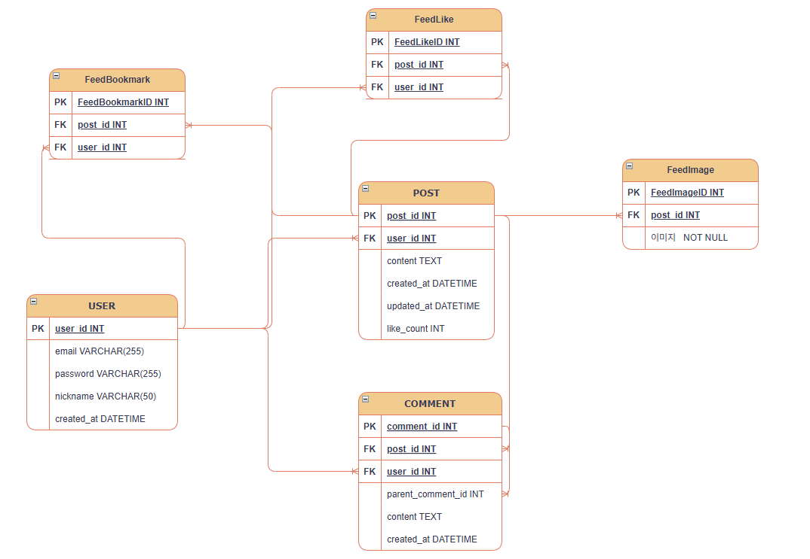

# SNS 서비스 데이터베이스 고도화 프로젝트 (SNS-Service v1.1)

## 1. 📂 프로젝트 구조 (Repository Structure)
└── database/
    └── sns-service-practice/         # SNS DB 설계 프로젝트
        ├── sns_erd_v1.1.drawio       # 고도화 설계 원본 (최종)
        ├── sns_erd_v1.1.png          # 최종 ERD 이미지 파일
        └── README.md                 # 프로젝트 명세서 (본 파일)

### 2. 기획 의도 (Why)
- 초기 단순 설계에서 벗어나, 실제 대규모 트래픽을 견딜 수 있는 실무형 SNS 데이터 구조를 구축하고자 했습니다.
- 다중 이미지 업로드 및 효율적인 좋아요 카운팅 시스템을 구현하여 사용자에게 보다 쾌적한 환경을 제공하는 데 목적이 있습니다.

### 3. 설계 및 구조 (Architecture)
- 테이블 구성: USER, POST, COMMENT, FeedImage, FeedLike, FeedBookmark 테이블로 구성했습니다.
- 핵심 구조:
  - 다중 이미지 관리: 1:N 관계의 FeedImage 테이블을 독립시켜 한 게시물당 여러 사진을 관리할 수 있도록 설계했습니다.
  - 성능 최적화: POST 테이블에 like_count를 직접 삽입(역정규화)하여 조회 시 발생하는 연산 부담을 최소화했습니다.
  - 대댓글 기능: COMMENT 테이블의 parent_comment_id를 활용한 자기 참조 구조를 통해 계층형 댓글 구현이 가능하게 했습니다.

### 4. 내가 이 설계를 하면서 했던 고민들 (My Thoughts)
- 처음에는 모든 데이터를 정석대로 분리하는 정규화만 고려했으나, 실제 인스타그램과 같은 대형 서비스에서 매번 좋아요 숫자를 연산하는 것은 비효율적이라는 판단이 들었습니다. 이에 따라 성능과 데이터 무결성 사이의 타협점인 역정규화 방식을 선택하며 이론과 실무의 차이를 깊이 있게 고민해 보았습니다.

### 5. 트러블슈팅 (Troubleshooting)
- 문제: 초기 설계 과정에서 POST 테이블과 FeedImage 테이블 양쪽에 이미지 정보가 중복으로 포함되는 설계 오류가 있었습니다.
- 해결: 데이터의 단일 출처(Single Source of Truth) 원칙을 준수하기 위해 POST의 이미지 컬럼을 과감히 삭제하고 FeedImage 테이블로 정보를 일원화하여 해결했습니다.

### 6. 업데이트 기록 (Changelog)
- v1.0 : 초기 ERD 설계 및 테이블 관계 설정 완료.
- v1.1 : 테이블 네이밍 통일(Snake Case), 다중 이미지 처리 구조화 및 like_count 역정규화 반영.

### 7. 실무 관점의 참견 (Insight)
- 실제 서비스 운영 시 사용자가 늘어남에 따라 게시글 조회 성능이 핵심 경쟁력이 됩니다. 이때 like_count와 같은 역정규화 설계가 큰 효과를 발휘할 것입니다. 보안 및 데이터 추적을 위해 모든 테이블에 생성 및 수정 시간을 포함한 점 역시 실무적으로 매우 훌륭한 판단입니다.

### 8. 성장 포인트 (Retrospective)
- 복잡하게 얽혀 있던 관계선과 명칭들을 체계적으로 정리하는 과정을 통해, '가독성이 높은 설계도가 곧 효율적인 개발의 시작'이라는 소중한 교훈을 얻었습니다.