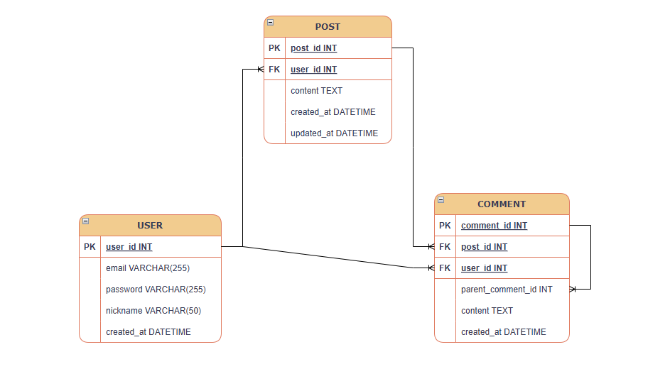

# 📱 SNS 서비스 데이터베이스 설계 프로젝트

## 1. 프로젝트 개요
실제 서비스 가능한 수준의 SNS(소셜 네트워크 서비스)를 목표로, 효율적인 데이터 관리와 확장성을 고려하여 데이터베이스의 핵심 구조를 1차 설계한 프로젝트입니다.

## 2. ERD (Entity Relationship Diagram)

## 3. 설계 고민 및 님의 생각 (Considerations)
설계 과정에서 다음과 같은 고민을 거쳤습니다.

- **직접 연결의 필요성**: `COMMENT` 테이블과 `USER` 테이블을 직접 연결(`user_id`)할지 고민했습니다. 결론적으로, 게시물을 거치지 않고 작성자 정보를 바로 조회하기 위해 직접 연결을 선택하여 성능 효율을 높였습니다.
- **데이터 무결성**: 모든 게시물과 댓글은 작성자가 반드시 있어야 하므로 **Mandatory(필수)** 관계를 설정했습니다.
- **대댓글 구조**: 단순한 댓글을 넘어 `parent_comment_id`를 활용한 **Self-Join** 구조를 설계하여 계층형 댓글 서비스가 가능하게 했습니다.

## 4. 실무형 변수명 및 데이터 타입 가이드
실무에서 자주 쓰이는 명명 규칙을 적용했습니다.

| 변수명 (Field Name) | 데이터 타입 | 설명 |
| :--- | :--- | :--- |
| `user_id`, `post_id` | **INT** | 고유 번호(Primary Key)는 숫자로 관리합니다. |
| `email`, `nickname` | **VARCHAR(255)** | 가변 길이 문자로, 메모리를 효율적으로 사용합니다. |
| `content` | **TEXT** | 긴 본문을 저장하기 위해 제한이 적은 타입을 썼습니다. |
| `created_at` | **DATETIME** | `at`이 붙는 변수는 '시간'을 의미하며 날짜 타입을 씁니다. |
| `updated_at` | **DATETIME** | 게시물 수정 시 "수정됨" 표시를 하기 위한 필수 필드입니다. |